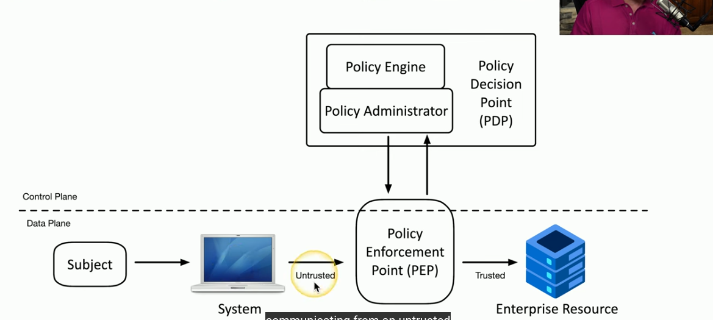

# 1.2 Zero Trust

Created time: 8 décembre 2024 19:56
Last edited by: OLB_
Last edited time: 6 avril 2025 12:48

- ZTNA = approche holistique (globale) de la sécu réseau
    - Tout est vérifié & chaque accès à chaque ressource doit faire l’objet d’un contrôle
    - Segmentation fonctionnelle du réseau / Security Zones
        - Marketing / IT …
        - Trusted / Untrusted
    - Mise en oeuvre de **SDN (Software-defined network)** pour séparer le **data plane** (processing de données) du **control plane** (règles de sécurité, analyse) et **centraliser les contrôles et configurations réseau**
    - Adaptive identity :
        - pour une identité avoir des controles renforcés selon
            - provenance: IP, réseau source
            - type de connection: wireless / lan
            - ressources demandées
    - Limitation des points d’entrée
        - LAN ou VPN seulement si externe
    - Politique de règles d’accès - **Policy-Driven Access Control**
    
    ### SDN **Software-defined network and Zero Trust**
    
    - **PEP** (Policy Enforcement Point) - Data Plane
        - Point de contrôle des datas (data plane)
    - **PDP** (Policy Decision Point) - Control Plane
        - Policy Engine: moteur de règle qui décide de l’accès
        - Policy Administrator: communique avec le PEP et distribue les accès

**Exemples :**

**PDP** 

- WS02 / Keycloak / Azur AD / Okta / OPA Open Policy Agent

**PEP**

- Firewalls, Switches, points d’accès (pfSense, OpenVPN, Google Authenticator, Fail2ban), CASB