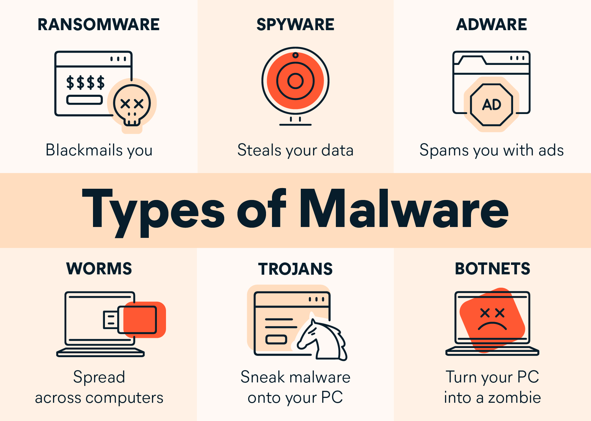

# 2.4 Overview of malware

Created time: 29 décembre 2024 21:36
Last edited by: OLB_
Last edited time: 22 mars 2025 16:50

- Malicious software
    - gather information
    - remote access
    - show advertising
    - encrypt data
- Ransomware
    - encrypt data
    - ask for money
        - to recover data
        - to not divulge data
    - protection :
        - backup offline / isolated
        - update system
        - anti-virus / anti-malware / EDR
    - IoC
        - trace of C2 communication (Command and Control)
        - persistent tools
        - lateral movement traces
        - encryption of files
        - notice to user with ransom demand
        - data exfiltration traces / large file transfer
- Trojans
    - disguise in legitimate software
    - seek remote access or steeling info
    - Mitigation
        - awareness program
        - EDR
    - IoC
        - C2 traces (port IRC 6667 or HTTPS)



- Malware Analysis
    - Virus Total , [Any.run](http://Any.run) … online services
    - sandbox tools : cuckoo sandbox…
    - manual code analysis
    - Tools like strings, binwalk, ghidra
    
    ```bash
    strings <filename>
    
    ```